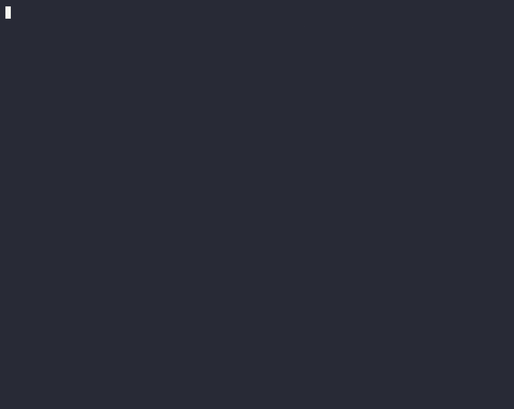

# a11y-checker — review build

A local accessibility checker for React/TSX code, grounded in a real-world audit corpus. It finds accessibility bugs at the source — **including in the design-system components a normal linter is blind to** — and tells you how common each failure is across real audits, with the fix that worked.

> **It runs entirely on your machine. No network, no account, no upload — your code never leaves the laptop.** That's not a privacy policy, it's how it's built: there's nothing to upload. Point it at a private repo with zero hesitation.

This is a private review build. Clone it, point it at any React codebase (yours or ours), and see what it finds — no setup, no explanation needed.

> **New here? Start with the [Getting Started](docs/GETTING-STARTED.md) walkthrough.** Zero to your first fix — install, `init`, wire your editor, read a finding, clear it, gate CI.
>
> **Just want it on your PRs?** The [CI Quickstart](docs/QUICKSTART-CI.md) is the 5-minute path — copy [`examples/github-actions/a11y.yml`](examples/github-actions/a11y.yml), open a PR, read the findings. No account, no secret.

---

## See it in 30 seconds

On **shadcn/ui's own `taxonomy` app**, `eslint-plugin-jsx-a11y` (the linter everyone runs) passes the docs search box **clean** — while a11y-checker catches its unlabeled `<Input>`, ranks it (`22/26 orgs`), and hands you the fix.



**▶ [Watch all five demos →](demo/README.md)** — the head-to-head above, a getting-started walkthrough on the cal.com monorepo, the `binclusive.json` config reference, the state of accessibility across 31 OSS repos, and the agentic self-fix loop. Each is a replayable [asciinema](https://asciinema.org) cast (`asciinema play demo/<name>.cast`), not just a GIF.

---

## Try it (≈3 minutes)

Requires **Node ≥ 20** and **pnpm** (or npm).

```bash
pnpm install                          # or: npm install
pnpm scan path/to/any/app/src         # any folder of .tsx files
```

That's the whole thing. It scans every `.tsx` under the folder and prints a coverage report + the findings. Run it on code you know — you'll be able to judge instantly whether each finding is real.

No clone handy? Point it at this repo's own test fixtures: `pnpm scan ./test/fixtures`.

> **No React source?** (A live site, an ASP.NET/Razor app, plain HTML.) The same checker can render a real page in a browser and audit the live DOM — `pnpm scan:url https://www.example.com`. See **[Auditing HTML & live pages (non-React)](#auditing-html--live-pages-non-react)** below.

> **Using your own design system?** (Almost everyone is.) A cold scan leaves most of your components in `declare` — *that's expected, not a failure.* To turn on its best trick (finding bugs *inside* your own components), it needs to know which of your components are buttons, inputs, etc. You don't write that by hand:
>
> ```bash
> pnpm a11y-checker init --suggest    # scaffolds the config for you
> ```
>
> It guesses a host for each of your design-system primitives, flags the uncertain ones with `⚠`, and leaves composites alone — so adoption is a **~2-minute review**, not hand-written config. Full on-ramp: **[WALKTHROUGH.md](WALKTHROUGH.md)** — read it before judging a cold run.

---

## What you'll see

```
a11y coverage:
  checked  70   — elements we inspected (findings come from here)
  trusted  60   — from a known-accessible design system — the library handles these
  declare  702  — unrecognized; declare in binclusive.json to inspect them

components/.../AddIntegrationModal.tsx
  AddIntegrationModal.tsx:276
    rule:   enforce/input-no-name  [block]  (call-site content check)
    wcag:   1.3.1, 3.3.2
    corpus: [VERY COMMON] SC 1.3.1 — 22/26 orgs
    fix:    Associate every form field with a <label> via id (not placeholder-only)...

91 finding(s)   VERY COMMON: 87  |  COMMON: 4
enforcement: 91 blocking · 0 warning
```

- **coverage is honest.** Most of a design-system app is *trusted* library components — nothing to flag there, and that's correct, not blindness. The number that matters is "did it find the real bugs," not "what % did it inspect."
- **each finding carries real-world weight** — its WCAG criterion, how widespread it is across our audits (`X/26 orgs`), and the representative fix.
- **`(call-site content check)`** marks findings that reach *trusted* components a normal linter skips. That's the recall win — "trusted" stops being false reassurance.

> **About the exit code:** `scan` exits non-zero when it finds *blocking* issues, so it can gate a CI build. If your run ends with `Command failed with exit code 1`, that's **not** an error — it means it found something. Read the report above it.

---

## What is this, in 30 seconds

Two passes + one corpus:

1. the normal structural lint (`eslint-plugin-jsx-a11y`) over a resolved component map, **plus**
2. a **content check at the call site** that catches bugs hiding inside "trusted" library components (an icon-only button with no name, an input with no label), **plus**
3. every finding **matched to a corpus** of real Binclusive audit failures — so it says not just *that* it's wrong, but *how common* it is in the wild and the fix that worked.

A generic linter can't do 2 or 3. The deeper story (and why the corpus is a moat) is in `docs/`.

There's also a **second producer**: a rendered-DOM collector that drives a real browser to a URL and runs axe-core against the live page — same corpus, same WCAG, same enforcement gate, no source required. That's the next section.

---

## Auditing HTML & live pages (non-React)

The scan above works on `.tsx` source. But not every page *has* React source on disk — a deployed site, an ASP.NET/Razor app, a plain HTML/Bootstrap/jQuery page. For those, point the checker at the **rendered page** instead of the source:

```bash
pnpm exec playwright install chromium   # one-time: the browser the render path drives
```

```bash
pnpm scan:url https://www.example.com   # a deployed site
pnpm scan:url http://localhost:5000     # your local dev server
pnpm scan:url ./wwwroot/index.html      # a local static .html file (bare path works)
```

`<target>` takes an `http(s)://` URL, a `file://` URL, or a **bare local path** (auto-converted to `file://`). Under the hood it renders the page in real Chromium (via Playwright), runs **axe-core** against the live DOM, then flows every finding through the *same* corpus / WCAG / enforcement machinery as the source scan — so a contrast bug on a live site comes back tiered and gated exactly like a missing label in your `.tsx`.

This is the source-less path — one command audits any live site, React or not.

- **Templates need a running server.** A server-side template (`.cshtml` Razor, `.erb`, etc.) is **not** valid standalone HTML — it's `@`-directives, loops, interpolation — so `file://` can't render it. Point `check-url` at the **running app** (`localhost`) for templates. Only plain `.html` files render directly via `file://`.
- **It catches what static analysis can't.** A real browser render surfaces categories the `.tsx` scan and even headless DOMs (jsdom) are blind to — notably **color-contrast (WCAG 1.4.3)**, computed ARIA roles, and layout-dependent rules.
- **Honest edge:** the seed corpus snapshot currently covers ~10 success criteria and does **not** yet include some SCs this path surfaces (e.g. 1.4.3 contrast, 1.4.1, 2.4.4). Those findings still appear — the render catches them regardless — but they roll up as tier `UNKNOWN` (no corpus fix text) until the corpus is extended.

The full walkthrough — install once, read the output, the `(rendered-DOM / axe)` provenance tag — is in **`docs/AUDIT-URL.md`**.

---

## Use it in CI (GitHub Action)

Drop the Action into a pull-request workflow. On every PR it scans the changed
`.tsx` files, posts inline review comments, and writes a SARIF file. Feed that
file to GitHub's own `upload-sarif` step and the findings also render as
**native code-scanning annotations** on the PR diff — the reference UX, à la
CodeQL. The scan is **advisory by default: it exits 0** and never blocks a merge
— unless you [opt into a blocking check](#optional--opt-into-a-blocking-check-default-off).

```yaml
name: a11y
on: pull_request

permissions:
  contents: read
  pull-requests: write   # inline review comments
  security-events: write # upload SARIF as code-scanning annotations

jobs:
  a11y:
    runs-on: ubuntu-latest
    steps:
      - uses: actions/checkout@v4
      - id: a11y
        uses: Binclusive/a11y@v0.1.1
      - if: always()  # advisory gate exits 0; upload regardless of findings
        uses: github/codeql-action/upload-sarif@v3
        with:
          sarif_file: ${{ steps.a11y.outputs.sarif-file }}
```

Annotations land on the exact changed file + line, and each carries its
provenance (`deterministic` vs `agent`) in the SARIF property bag. The SARIF
file exists only to render on **your** GitHub — it carries file/line for local
annotation and is never sent to the Binclusive dashboard.

> **Pin for supply-chain safety.** The examples pin to the released tag
> `@v0.1.1`. For production, pin to a commit SHA — `uses:
> Binclusive/a11y@<sha>  # v0.1.1` — rather than a floating tag or branch, so a
> moved tag can't silently change what runs in your CI. Dependabot
> (`github-actions` ecosystem) will bump the pin for you.

### Optional — opt into a blocking check (default off)

The check is **non-blocking by default**: it exits 0 on any severity or volume of
findings, so it never breaks your CI. Blocking is **strictly opt-in**. Set either
input below and the check **fails** (non-zero, surfaced as an Action failure) when
the threshold is met — the inline comments, PR summary, and SARIF still post either
way.

| Input | Set it to | Effect | Absent (default) |
|---|---|---|---|
| `fail-on` | `critical` \| `major` \| `minor` | Fail when any finding is **at or above** that severity (the engine's `critical < major < minor` ordering) | Non-blocking — findings never fail the check on severity |
| `max-violations` | an integer `N` | Fail when the total finding count **exceeds** `N` | No volume gate |

```yaml
      - id: a11y
        uses: Binclusive/a11y@v0.1.1
        with:
          fail-on: critical    # optional — block only on critical findings
          # max-violations: 0  # optional — block on any finding at all
```

Both use the **same** severity vocabulary as the engine's `check` command — there
is no separate CI severity map. Leaving both unset keeps the reference,
always-green advisory behavior.

### Optional secrets — AI lane & dashboard

The deterministic floor above needs **no account and no secret**. Two optional,
independent inputs unlock the extra lanes — supply neither, one, or both. Absent
means "lane off", never an error; the scan still exits 0.

| Input | Secret it carries | Absent → | Notes |
|---|---|---|---|
| `llm-api-key` | Your **own** LLM provider key (BYOK) | AI enrichment lane skipped; deterministic floor still runs | Provider-agnostic — no provider is baked into the Action or image. Your credential; it never leaves the runner for the dashboard. |
| `llm-model` | — (a model id, not a secret) | Engine default — Anthropic `claude-haiku-4-5-20251001` | Overrides the model the AI lane uses. Only meaningful with `llm-api-key`. |
| `llm-provider` | — (a provider id, not a secret) | Engine default — `anthropic` | Selects the AI-lane provider. Only meaningful with `llm-api-key`; an unrecognized value degrades to the deterministic floor. |
| `b8e-token` | A Binclusive `b8e_` apiKey | No phone-home; scan stays fully local | Mint it in the Binclusive dashboard. Metadata-only ingestion bearer. Unrelated to the LLM key. |

```yaml
      - id: a11y
        uses: Binclusive/a11y@v0.1.1
        with:
          llm-api-key:  ${{ secrets.LLM_API_KEY }}  # optional — your BYOK model key
          llm-model:    ""                          # optional — override the model
          llm-provider: ""                          # optional — override the provider
          b8e-token:    ${{ secrets.B8E_TOKEN }}    # optional — dashboard ingestion
```

Store both as encrypted repo (or org) secrets. The `b8e-token` authenticates the
phone-home to Binclusive; the `llm-api-key` never touches Binclusive auth — the
two are orthogonal. No Binclusive LLM credential ships in the image or the
Action defaults.

### Optional — post comments as the branded Binclusive bot

By default the PR comments (both the inline per-finding comments and the single
rollup comment) post under the workflow's `github-token`, which GitHub attributes
to **`github-actions[bot]`**. Install the **Binclusive GitHub App** and supply its
id + private key to have the comments post under the branded App identity — name +
avatar — instead. This is a pure identity swap: *who* posts changes, *what* posts
does not, and nothing new crosses the wire.

| Input | Carries | Absent → |
|---|---|---|
| `binclusive-app-id` | The Binclusive GitHub App id | Comments post under `github-token` as `github-actions[bot]` (no change) |
| `binclusive-app-private-key` | The App's PEM private key (a secret) | Same fallback |
| `binclusive-app-installation-id` | The App's installation id (optional) | Discovered automatically from the repo |

```yaml
      - id: a11y
        uses: Binclusive/a11y@v0.1.1
        with:
          binclusive-app-id:          ${{ vars.BINCLUSIVE_APP_ID }}
          binclusive-app-private-key: ${{ secrets.BINCLUSIVE_APP_PRIVATE_KEY }}
```

**Least privilege:** the App needs only **`Pull requests: write`** — enough to
post inline review comments and the rollup comment, nothing more. If the App is
unconfigured, the id/key is wrong, or the token mint fails for any reason, the
Action **falls back to `github-token` and still exits 0** — a failed brand is
never a failed check.

## Use it on any other CI/CD (generic `--ci` mode)

Not on GitHub? The engine runs the same scan on **CircleCI, Jenkins, Drone, or a
bare `docker run`** with no native adapter — just run the image and emit a standard
artifact:

```sh
docker run --rm -v "$PWD:/workspace" -w /workspace -e A11Y_PLATFORM=null \
  ghcr.io/binclusive/a11y:latest \
  check /workspace/src --ci --format sarif > a11y.sarif
```

`--format sarif` emits a valid **SARIF 2.1.0** log (or `--format json` for the raw
report); `--ci` makes the **non-blocking exit-0 a first-class engine mode** — the
run always exits 0 even with blocking findings, so any platform can consume the
artifact without failing the build. With no PR/MR context nothing is posted and the
artifacts still emit. Opt into a failing build with `--fail-on` / `--max-violations`.

Copy-paste CircleCI / Jenkins / Drone snippets, and the config-scaffold pattern that
native platform adapters build on, are in **[`docs/CI.md`](docs/CI.md)**.

---

## Dig deeper

| If you want… | Open / read |
|---|---|
| **Adopt it with your own design system** | **`WALKTHROUGH.md`** |
| **Run it on any CI/CD (CircleCI / Jenkins / Drone / generic)** | **`docs/CI.md`** |
| **Ready-made configs for GitLab / CircleCI / Buildkite / Jenkins / Bitbucket** | **[`examples/ci/`](examples/ci/)** |
| **Audit a live URL or HTML page (non-React)** | **`docs/AUDIT-URL.md`** |
| The pitch + the moat, with numbers | `docs/decks/numbers.html` |
| Real findings on real OSS projects | `docs/decks/showcase.html` |
| How the machine works, conceptually | `docs/decks/engineering.html` |
| How it's built — the craft | `docs/decks/engineering-deep.html` |
| **The code map — which file does what** | `docs/ARCHITECTURE.md` |
| **The questions you're about to ask** | `FAQ.md` |

The decks are self-contained HTML — open in a browser, arrow keys to navigate, `O` for contents.

---

## Kick the tires

```bash
pnpm test        # all green
pnpm typecheck   # clean
```

Editor surfaces (an MCP server + a Claude Code auto-whisper hook that fixes a11y as the AI writes) are in `plugin/` — `pnpm mcp` starts the local MCP server. The CLI above is the fastest way to feel what it does.

---

*Structure note: this is the `a11y-checker` package extracted to run standalone. Where `docs/ARCHITECTURE.md` says `packages/a11y-checker/src/…`, in this repo it's just `src/…`.*
