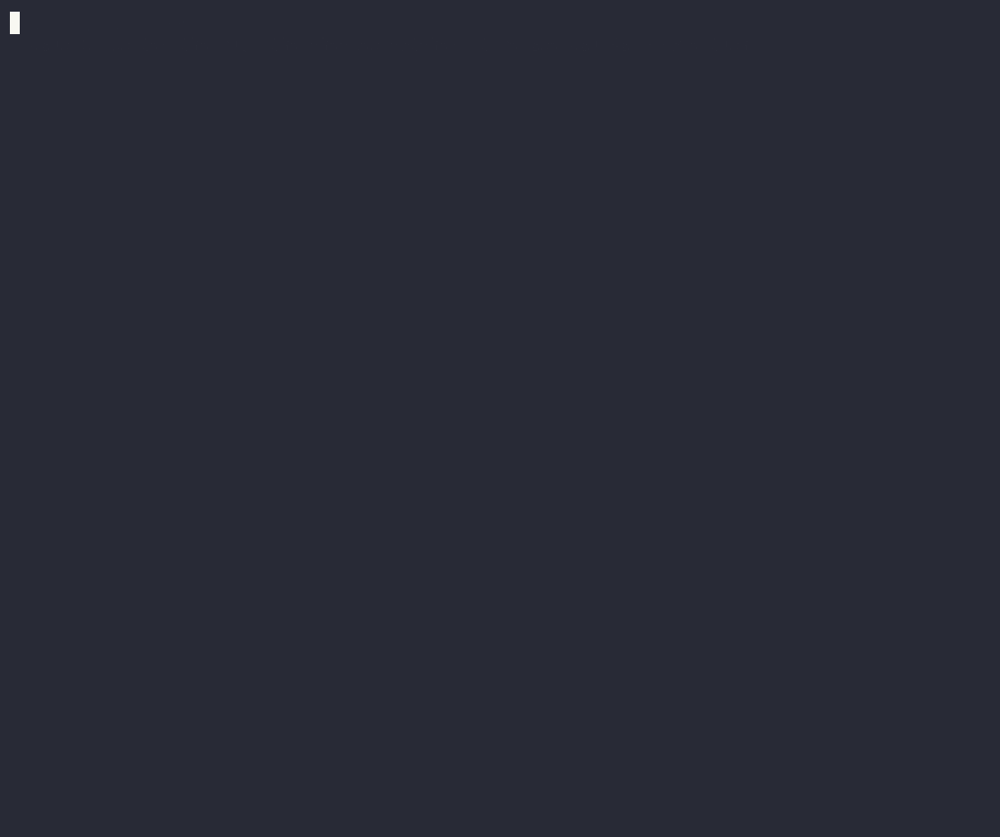

# demo/ — the a11y-checker demos

Five recorded terminal casts, ordered as a narrative: **prove it → onboard →
configure → show it's systemic → watch it self-fix.** Every byte on screen is
real output captured from the actual tool — see [How these are recorded](#how-these-are-recorded).

Each cast ships three ways to consume it:
- **GIF** — `demo/<name>.gif`, embed-anywhere (READMEs, slides, Slack).
- **Live** — `asciinema play demo/<name>.cast` — crisp, selectable text, real pacing.
- **Rebuild** — `bash demo/record-<name>.sh` — re-captures real bytes and re-renders.

---

## 1. The wow — eslint passes, we catch it  ·  `taxonomy`


On **shadcn/ui's own `taxonomy` app**, `eslint-plugin-jsx-a11y` (recommended)
passes the docs search box **clean** — while a11y-checker flags its `<Input>` as
`enforce/input-no-name` (WCAG 1.3.1, `22/26 orgs`) with the fix. The bug the
linter everyone trusts walks past, in the code thousands of devs copy from.

```sh
asciinema play demo/taxonomy.cast      # ~73s · live
bash demo/record-taxonomy.sh           # rebuild gif + cast
```

## 2. Getting started — install → fix → gate  ·  `tutorial`


Zero to your first fix on the **real cal.com monorepo**: `init` detects
`next · @calcom/ui · ts`, the checker traces your design system straight from
`packages/ui` (zero declaration), finds a real bug in the cancel-booking flow,
you fix it in one line, and gate CI. Six steps, all on a Turborepo.

```sh
asciinema play demo/tutorial.cast      # ~109s · live
bash demo/record-tutorial.sh           # clones cal.com on first run, then rebuilds
```

## 3. The config, explained — `binclusive.json`  ·  `config`


A field-by-field tour of the one committed contract: what `init` writes, the
`enforcement` lever (`block` fails CI / `warn` surfaces), the `components`
escape-hatch + `init --suggest` scaffolding **30** mappings, the
`injectsChildren`/`ignore` hatches, and team `learn` rules.

```sh
asciinema play demo/config.cast        # ~105s · live
bash demo/record-config.sh             # recomputes from cal.com apps/web
```

## 4. It's systemic — the state of OSS a11y  ·  `oss`


A data cast: across **31** well-known React+TS repos, **12** ship a control a
screen reader can't name — **372** in total (212 buttons, 150 inputs, 7 dialogs,
3 links), in shadcn, Google, Alibaba, Untitled UI. eslint passed every one. Not
bad engineers — a blind spot in the standard tool.

```sh
asciinema play demo/oss.cast           # ~61s · live
bash demo/record-oss.sh                # recomputes from experiments/stack-matrix/results
```

## 5. The agentic loop — it self-fixes  ·  `agent`



A Claude Code session: the AI writes a `ProductCard` the common (broken) way —
a clickable `<div>`, an `` with no alt. The **PostToolUse auto-whisper hook
fires unasked**, the model reads the findings, and fixes both in the same turn,
before any human sees it. The whisper output is real `hook` output.

```sh
asciinema play demo/agent.cast         # ~42s · live
bash demo/record-agent.sh              # drives the real hook command
```

---

## How these are recorded

[asciinema](https://asciinema.org) records a terminal session as a **`.cast`** —
a small JSON file of timestamped output. Unlike a GIF it's real, selectable text:
you can replay it (`asciinema play`), embed a player, or share a URL
(`asciinema upload demo/<name>.cast`). We render each `.cast` to a GIF with
[`agg`](https://github.com/asciinema/agg) for places that need an image.

```sh
brew install asciinema agg             # one-time
asciinema play demo/agent.cast         # replay any cast in your terminal
agg --font-size 18 demo/agent.cast demo/agent.gif   # cast → gif
```

### Why we *synthesize* the cast instead of `asciinema rec`

`asciinema rec` records a live TTY. In a headless shell (CI, an agent session,
no controlling terminal) there's no TTY, and the headless recorder **doesn't
honor real `sleep` timing** — so a recorded GIF races by in a few seconds with
no readable pacing. Driving a live `rec` also means the pacing, typos, and
retries are whatever happened that take.

So each of these five casts is **built deterministically** from two files:

| File | Role |
|---|---|
| `demo/make-<name>-cast.py` | The **script + direction**: the story, the narration, the typewriter effect, the colors, and frame-exact timing. Emits a v2 `.cast` on stdout. |
| `demo/record-<name>.sh` | The **capture + render**: runs the *real* tool to capture authentic bytes (scan output, `--suggest` map, the hook whisper), then runs the generator and `agg`. One command, reproducible. |

The generator controls every pause to the millisecond, so the result is calm and
readable — but it never invents output: the finding text, coverage numbers,
`--suggest` mappings, and hook whispers are all captured live by `record-<name>.sh`
from the actual CLI. Change the tool, re-run the `record` script, and the cast
updates with the new real output.

### Authoring a new cast

1. Copy the closest `make-<name>-cast.py` and rewrite the story section.
2. In `record-<name>.sh`, capture the real bytes you want to embed into a temp
   dir (the generator reads them via the `CAP` env var).
3. `bash demo/record-<name>.sh` → writes `demo/<name>.cast` + `demo/<name>.gif`.
4. Sanity-check pacing by replaying the timeline, or just `asciinema play` it.

### Verifying a cast (watch it without eyes)

A `.cast` is JSON, so you can replay it as a text timeline to check pacing and
catch glitches before rendering — exactly how these were proofed:

```sh
python3 - demo/agent.cast <<'PY'
import json, re, sys
ev = [json.loads(l) for l in open(sys.argv[1]).read().splitlines()[1:] if l.strip()]
ansi = re.compile(r'\x1b\[[0-9;?]*[A-Za-z]'); agg = {}
for tt, _, d in ev:
    c = ansi.sub('', d).replace('\r', '')
    if '\x1b' in d and not c.strip(): continue
    agg[round(tt, 1)] = agg.get(round(tt, 1), '') + c
for s in sorted(agg):
    line = ' '.join(x for x in agg[s].split('\n') if x.strip())
    if line.strip(): print(f"{s:6.1f}s | {line[:90]}")
PY
```
